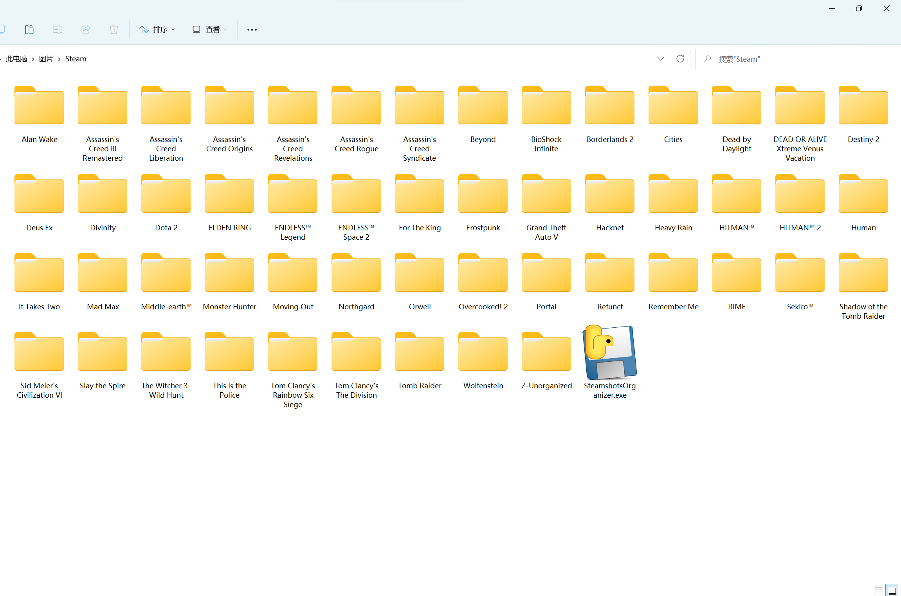

# Steam截图整理器 Steamshots-Organizer
## 效果图 Example

## 整理Steam截图  

### 使用方法:  
下载Releases中的最新版.exe文件到存放Steam截图的目录，然后运行。  
需要网络连接。

### 效果：
在该目录下，截图会进入对应游戏名的新建文件夹。  
如果这个游戏在Steam商店不存在了(比如某些限时Beta），则会进入名叫“Z-Unorganized”的文件夹（一般在最后一个）。

### 注意：
受到Windows文件夹命名的限制，游戏名中的‘:’会被替换为‘-’。其他受限制的字符暂未支持，需要支持请提交反馈。  
例如：“The Witcher 3: Wild Hunt”的截图会进入名叫“The Witcher 3- Wild Hunt”的文件夹。 

### 反馈：
欢迎在Issues区提交bug或申请新功能！

#### 更新日志：
v0.1：提供最基础的功能。  
v0.1.1：修复了尝试对非截图进行处理的bug。  
v0.1.2：将‘:’的处理从截断改为替换成‘-’。  
v0.1.3：将获取游戏列表的请求改为不进行SSL验证。  
v0.1.4：提升了游戏查找速度。

---
## Organize screenshots taken in Steam  

### Guide:
Download the latest version of .exe file in Releases to the same directory where screenshots are saved and execute.  
Requires Internet connection.

### Effect:
In this directory, screenshots will be organized into newly created folders that match their game names.  
If this game is no longer available in the Steam store (like some Beta), its screenshots will enter the folder called "Z-Unorganized" (usually at last).

### Note:
Under the Windows folder naming restrictions, the ':' in game names will be replaced with '-'. Other restricted symbols are yet to be supported. If you want, create an issue.  
E.g., the screenshots of "The Witcher 3: Wild Hunt" will enter the folder called "The Witcher 3- Wild Hunt".

### Feedback:
Welcome to report bugs or apply for new features in the Issues section!

#### UpdateLog:
v0.1: Provides basic functions.  
v0.1.1: Fixed bug trying to handle non-screenshots.  
v0.1.2: Changed the process of ':' from split to replace with '-'.  
v0.1.3: Changed the SSL verification of API request to False.  
v0.1.4: Improved game search performance.
